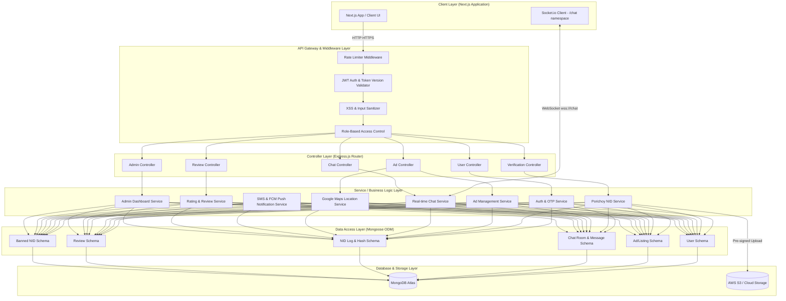

# System Architecture Proposal: Becha-Kena

**Architecture Type:** Layered Monolith  
**Frontend Stack:** Next.js (App Router, TailwindCSS, Socket.io-client)  
**Backend Stack:** Express.js (Node.js, TypeScript, Socket.io, Mongoose)  
**Database:** MongoDB Atlas (NoSQL) + Cloud Storage (S3/Cloudinary)  
**Verification APIs:** Porichoy API (NID validation), Google Maps API (Locations), SMS API (GP/Robi Gateway)

---

## 1. Architectural Diagram

Below is the layered structure of the proposed monolith system, showcasing how request-response flows traverse distinct logical boundaries:



---

## 2. Directory Structure

To keep the monolith modular and easy to navigate, we organize the backend code strictly by **technical layers (Controllers, Services, Repositories/Models)**, separating business logic from routers.

### Express.js Backend Directory Structure
```
backend/
├── src/
│   ├── config/             # DB connection, Cloud storage config, Env vars
│   ├── controllers/        # HTTP controllers
│   │   ├── admin.controller.ts
│   │   ├── auth.controller.ts
│   │   ├── ad.controller.ts
│   │   ├── user.controller.ts
│   │   ├── review.controller.ts
│   │   └── verification.controller.ts
│   ├── middlewares/        # Auth, Role guards, Rate limiter, Sanitizer, Error handlers
│   ├── models/             # Mongoose schemas
│   │   ├── user.ts
│   │   ├── listing.ts
│   │   ├── chatRoom.ts
│   │   ├── chatMessage.ts
│   │   ├── verificationLog.ts
│   │   ├── bannedNid.ts
│   │   └── review.ts
│   ├── routes/             # Express routes defining API endpoints
│   ├── services/           # CORE BUSINESS LOGIC
│   │   ├── admin.service.ts
│   │   ├── auth.service.ts
│   │   ├── ad.service.ts
│   │   ├── chat.service.ts
│   │   ├── geocoding.service.ts
│   │   ├── notification.service.ts
│   │   ├── review.service.ts
│   │   └── s3.service.ts
│   ├── sockets/            # WebSocket handlers and socket namespace setup (/chat)
│   ├── utils/              # Helper functions (hashing, OTP generator, validations)
│   ├── app.ts              # Express App setup
│   └── server.ts           # Server start, Websocket integration, listener
├── tests/                  # Integration and Unit tests
├── package.json
└── tsconfig.json
```

---

## 3. Detailed Service Approach & Design Decisions

### 3.1 Authentication & Session Management (Auth Service)
* **Approach:** Passwordless Mobile OTP Login + Secure JWT Cookies.
* **OTP Flow:**
  * When a user inputs their phone number (validated via regex `^(?:\+88|88)?(01[3-9]\d{8})$`), the backend **normalizes** it to the canonical stored format `+8801XXXXXXXXX` and generates a random 6-digit OTP.
  * The OTP is stored in a `temporary_otps` MongoDB collection with a TTL index set to **180 seconds** (3 minutes auto-expiry).
  * Rate-limiting: Express middleware checks IP and Phone number using `express-rate-limit` (Max 5 request OTPs per hour).
* **JWT Tokens & Token Version Revocation:**
  * Upon successful OTP validation, the backend generates an **Access Token** (expires in 15 mins) and a **Refresh Token** (expires in 7 days).
  * Access & Refresh tokens are sent to the client via secure **HTTP-only, SameSite=Strict, Secure cookies**.
  * **Revocation/Ban Strategy:** To immediately invalidate all active sessions of a user (e.g., when banned or suspended), a `tokenVersion` counter is stored in the `User` schema.
  * The current `tokenVersion` is embedded inside the JWT payload. The authentication middleware validates the payload's `tokenVersion` against the live record in the DB during token verification.
  * Banning a user increments the DB's `tokenVersion` and updates `status = 'suspended'`, rendering all active JWTs instantly useless.
* **Recycled SIM Card Handling:**
  * If a user registers with a phone number already tied to an existing account, the system requires NID verification for the new registration attempt.
  * If the NID hash of the new registrant does not match the NID hash associated with the old account, the old account is archived (listings hidden, data detached from the phone number), and a fresh account is created for the new user.
  * If the NID matches, the system treats it as a returning user login and restores the original account.

### 3.2 NID Identity Verification Service (NID Service)
* **Approach:** Hybrid Porichoy API + Admin Manual Validation Fallback.
* **NID Processing & Validation:**
  1. Frontend captures front & back of NID card.
  2. Frontend requests **Pre-Signed Upload URL** from the backend. The backend generates a secure S3 upload key. The client uploads images directly to S3.
  3. Client posts NID number, Date of Birth, and a live selfie to the `/api/v1/verify/nid` endpoint.
  4. Backend runs `Porichoy API` search. 
     * **Success:** If Porichoy returns a match, we run **Face Matching** (using AWS Rekognition CompareFaces API) to compare the selfie with the NID photo.
     * **Timeout/API Fail (EH-1, EX-1):** If Porichoy times out (>10 seconds) or runs out of credits, the system flags the transaction as `pending_review` and appends it to the manual verification queue.
* **Daily Attempt Reset Logic:**
  * Verification limits (Max 3 submissions) are enforced via `attemptsToday` and `lastAttemptDate` date fields in `VerificationLog`. If `lastAttemptDate` is older than today, `attemptsToday` is reset to 0 upon submission.
* **Data Storage:**
  * Raw NID photos are stored in S3 encrypted with KMS (AES-256). Pre-signed URLs for manual admin checks are generated on the fly with a **5-minute expiration**.
  * The NID number itself is **never stored in plain text**. A cryptographically salted hash of the NID (`SHA256(NID + Salt + Pepper)`) is saved in the `banned_nids` or `verification_logs` collections to check for duplicates and block banned users without storing PII.
* **Minor-to-Adult Transition Lifecycle:**
  * Users registered under a parental NID have a `minorTransitionDueDate` calculated from their date of birth (18th birthday + 30-day grace period).
  * A background scheduler checks for users whose `minorTransitionDueDate` has passed. If the user has not submitted their own NID and completed re-verification, their account status is restricted to Guest-level access (equivalent to unverified) until they complete their personal NID verification.
  * Upon successful re-verification with their own NID, the `parentNIDHash` reference is cleared, `ageGroup` is updated to `adult`, and the parent's minor account counter is decremented.

### 3.3 Ad Management & Expiration (Ad Service)
* **Approach:** Mongoose Listing model + Scheduler.
* **Ad Lifespan Lifecycle:**
  * Listings contain a `createdAt`, `status` (pending, active, archived, sold), and `expiresAt` (initialized to `createdAt + 30 days`).
  * A background worker (using node-cron or Agenda) executes daily tasks:
    * **Day 27:** Queries ads expiring in 3 days. Triggers a notification (`NT-2`) advising the seller to renew.
    * **Day 30:** Sets `status = 'archived'` for unrenewed ads.
* **Moderation Queue & Image Upload Confirmation:**
  * Newly created ads are set to `pending`. 
  * **Confirmation Flow:** To prevent orphan files in S3 storage (resulting from uploads that were never finalized), a client callback endpoint `POST /api/v1/ads/upload/confirm` must be executed to tie uploaded S3 files to the listing, validating the upload transaction. Unconfirmed uploads are deleted from S3 via scheduler after 24 hours.
  * Ads require keyword filtering. If flagged, listings are marked with moderation metadata (`moderationFlags`: `{ flagType, flagReason, reviewedBy }`) and placed in the moderation queue.
  * Modifying the title or changing the price > 20% resets the ad status to `pending` and flags it for re-moderation.

### 3.4 Secure Messaging & WebSocket Chat Service
* **Approach:** Isolated `/chat` namespace using Socket.io with JWT authentication.
* **Handshake Security & Namespace:**
  * Socket connections are routed to `/chat` and validated using the HTTP-only cookie JWT payload. Invalid tokens fail the handshake.
* **ChatRoom Uniqueness:**
  * Conversations are mapped to a unique `{ buyerId, sellerId, listingId }` tuple using a compound database unique index. If a buyer contacts a seller about a specific listing, the same `ChatRoom` is reused instead of creating duplicates.
* **Message Filters:**
  * WebSocket filters block external links, flag payment warnings, and mask phone numbers until contact sharing is explicitly approved by both users.

### 3.5 Rating & Review Service
* **Approach:** Explicit transaction-linked feedback rules.
* **Review Verification Rules:**
  * Users can rate (1-5 stars) and write text reviews.
  * A review is strictly allowed if:
    1. The seller marks the listing status as `sold`.
    2. The seller explicitly tags the listing's target buyer (must match the `buyerId` from the linked `ChatRoom` history).
    3. A chat history exists in the system between the buyer and the seller for that listing.
  * Average ratings and review counts are updated dynamically using Mongoose hooks on `Review` submissions and saved to the User document.

### 3.6 Admin & Dashboard Control Service
* **Approach:** Restricted routes managed via role-based access controls (`role: 'moderator' | 'admin'`).
* **Key Endpoints:**
  * Handling NID Manual Review approvals (accessing secure NID uploads via 5-min pre-signed URLs).
  * Flagging/Moderating ads.
  * Enforcing bans (updating user status to `suspended`, incrementing `tokenVersion` to invalidate active JWT cookies, and writing the NID hash to the `banned_nids` collection).
  * **Dispute & Report Management:** Reviewing user-submitted reports against listings or profiles. Reports track `reason`, `targetType` (listing or user), and `status` (pending/reviewed/resolved/dismissed). Admins can temporarily freeze suspicious accounts or escalate to permanent bans based on report investigations.
* **Account Deletion Lifecycle:**
  * Upon account deletion request, listings and chats are immediately hidden. `deletionRequestedAt` is set on the user document.
  * A background scheduler hard-deletes PII (name, NID photos, selfie URLs) after 30 days.
  * Banned NID hashes and ban history are retained permanently in the `banned_nids` collection.

---

## 4. Proposed Database Schema Drafts

### User Collection
```json
{
  "_id": "ObjectId",
  "phoneNumber": "string", // Canonical stored format: +8801XXXXXXXXX
  "displayName": "string",
  "verifiedName": "string",
  "isVerified": "boolean",
  "ageGroup": "string", // 'adult' | 'minor'
  "parentNIDHash": "string",
  "role": "string", // 'user' | 'moderator' | 'admin'
  "status": "string", // 'active' | 'suspended' | 'inactive'
  "tokenVersion": "number", // Incremented to invalidate all active JWTs
  "averageRating": "number",
  "totalReviews": "number",
  "fcmTokens": ["string"], // FCM tokens for push notification delivery
  "lastLoginDate": "date", // Tracks inactivity for 180-day auto-deactivation
  "deletionRequestedAt": "date", // Null unless account deletion is requested (30-day PII purge)
  "minorTransitionDueDate": "date", // For minor users: deadline to submit own NID after turning 18
  "createdAt": "date",
  "updatedAt": "date"
}
```

### VerificationLog Collection
```json
{
  "_id": "ObjectId",
  "userId": "ObjectId",
  "nidHash": "string",
  "dob": "date",
  "selfieUrl": "string",
  "verificationStatus": "string", // 'pending_review' | 'approved' | 'rejected'
  "attemptsToday": "number",
  "lastAttemptDate": "date", // Reset attemptsToday if older than today
  "manualReviewReason": "string", // Timeout / OCR fail / selfie mismatch
  "verifiedBy": "ObjectId", // Moderator ID
  "createdAt": "date"
}
```

### BannedNid Collection
```json
{
  "_id": "ObjectId",
  "nidHash": "string", // Salted NID Hash to block re-registration
  "reason": "string",
  "bannedBy": "ObjectId", // Admin ID
  "bannedAt": "date"
}
```

### Listings Collection
```json
{
  "_id": "ObjectId",
  "sellerId": "ObjectId",
  "title": "string",
  "description": "string",
  "price": "number",
  "category": "string",
  "condition": "string",
  "images": ["string"],
  "hidePhoneNumber": "boolean",
  "location": {
    "type": "Point",
    "coordinates": ["number", "number"], // [lng, lat]
    "addressLine": "string",
    "division": "string",
    "district": "string",
    "thana": "string"
  },
  "soldToBuyerId": "ObjectId", // Verified buyer selected by seller when marking as 'sold'
  "status": "string", // 'pending' | 'active' | 'archived' | 'sold'
  "moderationFlags": {
    "flagType": "string", // 'keyword' | 'image' | 'report' | 'manual'
    "flagReason": "string",
    "reviewedBy": "ObjectId"
  },
  "expiresAt": "date",
  "createdAt": "date",
  "updatedAt": "date"
}
```

### ChatRooms Collection
```json
{
  "_id": "ObjectId",
  "listingId": "ObjectId",
  "buyerId": "ObjectId",
  "sellerId": "ObjectId",
  "createdAt": "date"
}
// Note: Compound index: { buyerId: 1, sellerId: 1, listingId: 1 } (Unique)
```

### Reviews Collection
```json
{
  "_id": "ObjectId",
  "listingId": "ObjectId",
  "reviewerId": "ObjectId",
  "revieweeId": "ObjectId",
  "rating": "number", // 1-5
  "reviewText": "string",
  "createdAt": "date"
}
```

### TemporaryOtps Collection
```json
{
  "_id": "ObjectId",
  "phoneNumber": "string",
  "otpCode": "string",
  "expiresAt": "date",
  "createdAt": "date"
}
// Note: TTL Index on expiresAt for automatic expiration after 180 seconds (3 minutes).
```

### Reports Collection
```json
{
  "_id": "ObjectId",
  "reporterId": "ObjectId",
  "targetType": "string", // 'listing' | 'user'
  "targetId": "ObjectId",
  "reason": "string", // 'scam' | 'harassment' | 'misrepresentation' | 'inappropriate' | 'other'
  "description": "string",
  "status": "string", // 'pending' | 'reviewed' | 'resolved' | 'dismissed'
  "reviewedBy": "ObjectId",
  "resolution": "string",
  "createdAt": "date",
  "updatedAt": "date"
}
```

---

## 5. Architectural Recommendations & Feedback Requests

To ensure the architecture is flawless, we recommend the following choices. Please review and provide your feedback:

1. **OTP SMS Gateway Selection:**
   * Do we have a preferred SMS gateway provider in Bangladesh (e.g., SSL Wireless, Greenweb, BulksmsBD)? We should abstract the notification service so that switching providers requires only a config update.
2. **Face-Matching Logic Execution:**
   * Since liveness detection and face matching can be complex on low-powered mobile devices, we propose using **AWS Rekognition CompareFaces API** on the backend. This is highly accurate for comparing live selfies against Bangladeshi NID photo formats, which are often low-contrast or black-and-white.
3. **Database Security (NID Salt & Pepper management):**
   * To prevent reverse lookup attacks on NID hashes, the Salt and Pepper variables will be stored in secure environment variables (`NID_HASH_SALT` and `NID_HASH_PEPPER`) on AWS Secrets Manager or Vault, ensuring they are separate from the MongoDB Atlas database instance.
4. **BullMQ / Queue Engine for Background Tasks:**
   * To run the ad expiration and OTP cleanup tasks, a queue system is ideal. Can we use a simple Redis instance along with MongoDB Atlas to power **BullMQ** for clean background jobs, or do you prefer to keep the infrastructure strictly database-only using a library like **Agenda** (which uses MongoDB directly)?
