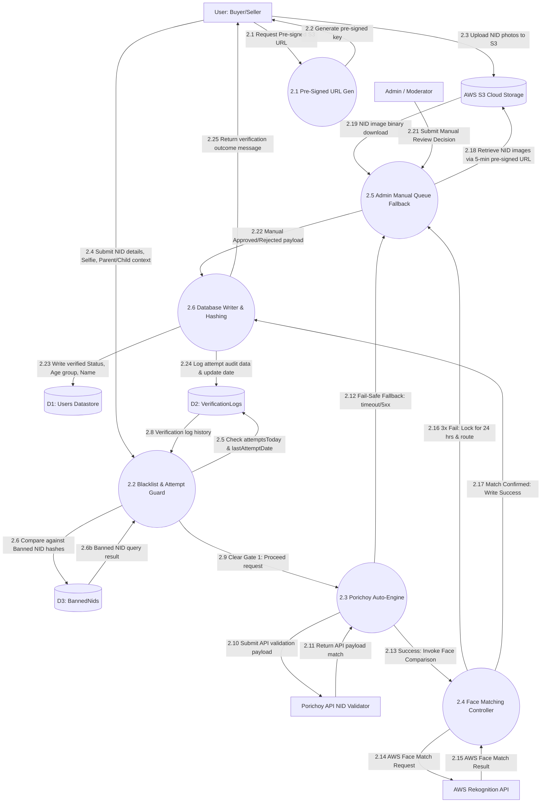

# Data Flow Diagram (DFD) Specifications: Becha-Kena

**Prepared by:** Senior Systems Architect & Business Analyst  
**Date:** June 26, 2026  
**System:** Becha-Kena C2C Classified Marketplace  
**Source Documents:** [prd.md](file:///c:/Users/afnan/Documents/becha-kena/prd.md) | [architecture.md](file:///c:/Users/afnan/Documents/becha-kena/architecture.md)

---

## 1. Context Diagram (Level 0 DFD)

The Context Diagram defines the system boundaries of the Becha-Kena application, outlining the interactions between the monolithic system boundary and external entities (Users, Admins, and external API gateways).

```mermaid
graph TD
    %% External Entities
    User[User: Buyer/Seller]
    Admin[System Admin / Moderator]
    Porichoy[Porichoy API NID Validator]
    GoogleMaps[Google Maps API]
    SMSGW[SMS API Gateway]
    FCM[Firebase Cloud Messaging FCM]
    Rekognition[AWS Rekognition API]

    %% System Boundary
    System((0. Becha-Kena System))

    %% Data Flows
    User -->|1.1 Phone Number| System
    System -->|1.2 SMS OTP Code Send| SMSGW
    SMSGW -->|1.3 OTP SMS Delivery| User
    User -->|1.4 OTP Submission| System
    System -->|1.5 HTTP Auth Cookie JWT| User

    User -->|2.1 Request Pre-signed S3 URL| System
    System -->|2.2 Return Pre-signed Upload URL| User
    User -->|2.3 Submit NID details & Selfie| System
    System -->|2.4 NID Verification Query| Porichoy
    Porichoy -->|2.5 Return Porichoy match| System
    System -->|2.6 Face Match Request| Rekognition
    Rekognition -->|2.7 Face Match Result| System
    System -->|2.8 Verification Status / Badge| User

    User -->|3.1 Ad Listing Data & Address| System
    System -->|3.2 Geocoding Lookup Request| GoogleMaps
    GoogleMaps -->|3.3 Address components lat-lng| System
    User -->|3.4 S3 Confirmation Callback| System
    System -->|3.5 Active Listing Feed| User

    User -->|4.1 Search Terms & Geoloc filters| System
    System -->|4.2 Geocoded Search Results| User

    User -->|5.1 WS Handshake & Chat Messages wss://| System
    System -->|5.2 Chat Warnings / Masked Chat Messages| User

    User -->|6.1 Rating & Review details| System
    System -->|6.2 Aggregated Rating Update Notification| User

    Admin -->|7.1 Admin Credentials & Session JWT| System
    Admin -->|7.2 NID Manual Queue Review Decision| System
    Admin -->|7.3 Moderate Ad Listings & Flag updates| System
    Admin -->|7.4 Suspension / Ban Trigger| System
    System -->|7.5 Audit Action Logging details| Admin

    System -->|8.1 FCM Offline Push Notice| FCM
    FCM -->|8.2 Push Alert| User
```



---

## 2. Level 1 DFD: Functional Decomposition

Level 1 DFD decomposes the system into 8 core logical processes, 6 persistent data stores, and details how data flows across them.

```mermaid
graph TD
    %% External Entities
    User[User: Buyer/Seller]
    Admin[System Admin / Moderator]
    Porichoy[Porichoy API NID Validator]
    GoogleMaps[Google Maps API]
    SMSGW[SMS API Gateway]
    FCM[Firebase Cloud Messaging FCM]
    S3_Store[(AWS S3 Cloud Storage)]
    Rekognition[AWS Rekognition API]

    %% Datastores
    subgraph Datastores ["Database Storage Layer (MongoDB Atlas)"]
        D1[(D1: Users Datastore)]
        D2[(D2: VerificationLogs)]
        D3[(D3: BannedNids)]
        D4[(D4: Listings)]
        D5[(D5: ChatRooms & Messages)]
        D6[(D6: Reviews)]
        D7[(D7: TemporaryOtps)]
        D8[(D8: Reports)]
    end

    %% Processes
    P1((1.0 Auth & OTP Engine))
    P2((2.0 KYC & Identity Validator))
    P3((3.0 Ad Posting Engine))
    P4((4.0 Search & Geospatial Finder))
    P5((5.0 WS Chat Room Coordinator))
    P6((6.0 Reviews & Ratings System))
    P7((7.0 Admin Portal & Auditing))
    P8((8.0 Scheduler Engine))

    %% Data Flow Actions for P1 (Auth & OTP)
    User -->|1.1 Register/Login phone number| P1
    P1 -->|1.2 Store hashed OTP with TTL| D7
    P1 -->|1.3 Request OTP delivery| SMSGW
    SMSGW -->|1.4 OTP SMS delivery| User
    User -->|1.5 Submit OTP| P1
    P1 -->|1.6 Validate OTP against store| D7
    P1 -->|1.7 Fetch/Create User profile| D1
    D1 -->|1.8 User profile details| P1
    P1 -->|1.9 Recycled SIM: Check existing phone owner NID| D2
    D2 -->|1.10 Existing NID hash for phone owner| P1
    P1 -->|1.11 JWT Cookie Response| User

    %% Data Flow Actions for P2 (KYC & NID Verification)
    User -->|2.1 Request Pre-signed S3 URL| P2
    P2 -->|2.2 Return Pre-signed Upload URL| User
    User -->|2.3 Upload NID Photos| S3_Store
    User -->|2.4 Submit NID details & Selfie| P2
    P2 -->|2.5 Check Banned NID Hash| D3
    D3 -->|2.6 Banned NID query result| P2
    P2 -->|2.7 Check attempts and limit| D2
    D2 -->|2.8 Verification log history| P2
    P2 -->|2.9 Submit NID verify request| Porichoy
    Porichoy -->|2.10 Return Porichoy match payload| P2
    P2 -->|2.11 Face Match Request| Rekognition
    Rekognition -->|2.12 Face Match Result| P2
    P2 -->|2.13 Write Verification Attempt Log| D2
    P2 -->|2.14 Update user verification status| D1
    P2 -->|2.15 Escalate to manual review queue| P7
    P2 -->|2.16 Success Badge or Pending status| User

    %% Data Flow Actions for P3 (Ad Posting Engine)
    User -->|3.1 Submit Ad Payload & Address| P3
    P3 -->|3.2 Geocoding Lookup Request| GoogleMaps
    GoogleMaps -->|3.3 Geocoded Lat-Lng coordinates| P3
    P3 -->|3.4 Validate S3 upload confirm| S3_Store
    S3_Store -->|3.5 S3 Confirmation callback| P3
    P3 -->|3.6 Check Seller verification badge| D1
    D1 -->|3.7 Seller verification status| P3
    P3 -->|3.8 Write/Update Ad listing| D4
    P3 -->|3.9 Active listing feed / confirmation| User

    %% Data Flow Actions for P4 (Search & Geospatial Finder)
    User -->|4.1 Search terms & location filters| P4
    P4 -->|4.2 Geocode search location| GoogleMaps
    GoogleMaps -->|4.3 Geocoded coordinates| P4
    P4 -->|4.4 Geospatial query coords| D4
    D4 -->|4.5 Retrieve matched active listings| P4
    P4 -->|4.6 Populate matched items list| User

    %% Data Flow Actions for P5 (WS Chat Room Coordinator)
    User -->|5.1 WS Handshake cookie & token| P5
    P5 -->|5.2 Check tokenVersion status| D1
    D1 -->|5.3 User tokenVersion status| P5
    P5 -->|5.4 Fetch/Create unique ChatRoom| D5
    D5 -->|5.5 ChatRoom metadata| P5
    User -->|5.6 WS Message raw text| P5
    P5 -->|5.7 Log/Save masked chat message| D5
    P5 -->|5.8 Deliver warnings/masked chat| User
    P5 -->|5.9 Send Offline push notice| FCM
    FCM -->|5.10 Push notification alert| User

    %% Data Flow Actions for P6 (Reviews & Ratings System)
    User -->|6.1 Rating & Review details| P6
    P6 -->|6.2 Verify listing sold and soldToBuyerId| D4
    D4 -->|6.3 Listing status and soldToBuyerId| P6
    P6 -->|6.4 Verify participant chat history| D5
    D5 -->|6.5 Chat history verification| P6
    P6 -->|6.6 Write reviews & update ratings| D6
    P6 -->|6.7 Aggregate User rating fields| D1
    P6 -->|6.8 Update rating confirmation| User

    %% Data Flow Actions for P7 (Admin Portal & Auditing)
    Admin -->|7.1 Moderator credentials & login| P7
    P7 -->|7.2 Verify admin role| D1
    D1 -->|7.3 Admin role verification success| P7
    Admin -->|7.4 Manual review decision/moderation action| P7
    P7 -->|7.5 Get NID photos via pre-signed URL| S3_Store
    S3_Store -->|7.6 NID photo pre-signed URL| P7
    P7 -->|7.7 Escalate manual verification decision| P2
    P7 -->|7.8 Audit flags & Moderation status updates| D4
    P7 -->|7.9 Suspend User & Increment tokenVersion| D1
    P7 -->|7.10 Blacklist hashed NID| D3
    P7 -->|7.11 Review dispute reports| D8
    D8 -->|7.12 Pending report details| P7
    P7 -->|7.13 Update report resolution status| D8
    P7 -->|7.14 Return Audit Action logs confirmation| Admin
    User -->|7.15 Submit dispute report| P7
    P7 -->|7.16 Write report record| D8

    %% Data Flow Actions for P8 (Scheduler Engine)
    P8 -->|8.1 Query inactive users over 180 days| D1
    D1 -->|8.2 Return inactive user IDs| P8
    P8 -->|8.3 Update user status to inactive| D1
    P8 -->|8.4 Auto-archive listings of inactive users| D4
    P8 -->|8.5 Query ads expiring in 3 days for Day 27 renewal| D4
    D4 -->|8.6 Return expiring listing IDs| P8
    P8 -->|8.7 Trigger renewal notification| FCM
    P8 -->|8.8 Auto-archive unrenewed ads at Day 30| D4
    P8 -->|8.9 Delete orphan unconfirmed S3 uploads after 24h| S3_Store
    P8 -->|8.10 Check minor transition due dates| D1
    D1 -->|8.11 Return overdue minor user IDs| P8
    P8 -->|8.12 Restrict overdue minor accounts to Guest| D1
    P8 -->|8.13 PII hard-delete for deletion requests over 30 days| D1
    P8 -->|8.14 Delete associated NID photos from S3| S3_Store
```



---

## 3. Level 2 DFD: Identity Verification Process (KYC)

This DFD zooms into **Process 2.0 (KYC & Identity Validator)** to show the low-level processing steps, check sequences, and fallback conditions.



---

## 4. Data Dictionary

### 4.1 Data Stores

#### D1: Users Datastore
* **Description:** Persists user authentication credentials, profiles, status, roles, trust metrics, FCM tokens, and validation version tokens.
* **Format:** MongoDB Collection
* **Attributes:**
  * `_id` (ObjectId, Primary Key)
  * `phoneNumber` (String, Unique, canonical format: `+8801XXXXXXXXX`)
  * `displayName` (String, 1-30 chars)
  * `verifiedName` (String, from Porichoy)
  * `isVerified` (Boolean)
  * `ageGroup` (String, Values: `adult` | `minor`)
  * `parentNIDHash` (String, Nullable, SHA-256 parent hash reference)
  * `role` (String, Values: `user` | `moderator` | `admin`)
  * `status` (String, Values: `active` | `suspended` | `inactive`)
  * `tokenVersion` (Number, starts at 0, incremented on ban/logout)
  * `averageRating` (Number)
  * `totalReviews` (Number)
  * `fcmTokens` (Array of Strings)
  * `lastLoginDate` (Date)
  * `deletionRequestedAt` (Date, Nullable, set on account deletion request for 30-day PII purge)
  * `minorTransitionDueDate` (Date, Nullable, deadline for minor users to submit own NID after turning 18)
  * `createdAt` (Date)
  * `updatedAt` (Date)

#### D2: VerificationLogs Datastore
* **Description:** Stores verification attempt history, rate limits per NID/User, and hashes of verified NIDs to prevent duplicate registration.
* **Format:** MongoDB Collection
* **Attributes:**
  * `_id` (ObjectId, Primary Key)
  * `userId` (ObjectId, Foreign Key -> D1)
  * `nidHash` (String, SHA-256 hashed NID, Non-Unique — same NID can appear across multiple attempts or minor accounts)
  * `dob` (Date)
  * `selfieUrl` (String, Encrypted cloud store URL)
  * `verificationStatus` (String, Values: `pending_review` | `approved` | `rejected`)
  * `attemptsToday` (Number, Max 3)
  * `lastAttemptDate` (Date)
  * `manualReviewReason` (String, Nullable)
  * `verifiedBy` (ObjectId, Nullable, Moderator ID -> D1)

#### D3: BannedNids Datastore
* **Description:** Blacklist repository containing cryptographically hashed NID cards belonging to users permanently banned from the platform.
* **Format:** MongoDB Collection
* **Attributes:**
  * `_id` (ObjectId, Primary Key)
  * `nidHash` (String, SHA-256 hashed NID, Unique Index)
  * `reason` (String)
  * `bannedBy` (ObjectId, Admin ID -> D1)
  * `bannedAt` (Date)

#### D4: Listings Datastore
* **Description:** Persists listings/classified ads posted by sellers, locations, moderation flags, and expiration parameters.
* **Format:** MongoDB Collection
* **Attributes:**
  * `_id` (ObjectId, Primary Key)
  * `sellerId` (ObjectId, Foreign Key -> D1)
  * `title` (String, 10-80 chars)
  * `description` (String, 20-1000 chars)
  * `price` (Number)
  * `category` (String)
  * `condition` (String, Values: `new` | `like_new` | `used`)
  * `images` (Array of Strings)
  * `hidePhoneNumber` (Boolean)
  * `location` (Object: GeoJSON Point with administrative hierarchy)
    * `type` (String, Value: `Point`)
    * `coordinates` (Array, Format: `[longitude, latitude]`)
    * `addressLine` (String, full text address)
    * `division` (String, administrative division)
    * `district` (String, administrative district)
    * `thana` (String, Thana/Upazila)
  * `soldToBuyerId` (ObjectId, Nullable, Foreign Key -> D1, the verified buyer selected by seller when marking as sold)
  * `status` (String, Values: `pending` | `active` | `archived` | `sold`)
  * `moderationFlags` (Sub-document)
    * `flagType` (String, Values: `keyword` | `image` | `report` | `manual` | `null`)
    * `flagReason` (String)
    * `reviewedBy` (ObjectId, Moderator ID -> D1)
  * `expiresAt` (Date)
  * `createdAt` (Date)
  * `updatedAt` (Date)

#### D5: ChatRooms & Messages Datastore
* **Description:** Tracks persistent chat sessions mapped to `{ buyerId, sellerId, listingId }` and individual websocket message records.
* **Format:** MongoDB Collection (divided into Rooms and Messages schemas)
* **Attributes (Rooms):**
  * `_id` (ObjectId, Primary Key)
  * `listingId` (ObjectId, Foreign Key -> D4)
  * `buyerId` (ObjectId, Foreign Key -> D1)
  * `sellerId` (ObjectId, Foreign Key -> D1)
  * Unique Compound Index: `{ buyerId: 1, sellerId: 1, listingId: 1 }`
* **Attributes (Messages):**
  * `_id` (ObjectId, Primary Key)
  * `roomId` (ObjectId, Foreign Key -> Room)
  * `senderId` (ObjectId, Foreign Key -> D1)
  * `messageText` (String, Masked)
  * `readStatus` (Boolean)
  * `createdAt` (Date)

#### D6: Reviews Datastore
* **Description:** Stores peer rating feedback details validated against completed transactions.
* **Format:** MongoDB Collection
* **Attributes:**
  * `_id` (ObjectId, Primary Key)
  * `listingId` (ObjectId, Foreign Key -> D4)
  * `reviewerId` (ObjectId, Foreign Key -> D1)
  * `revieweeId` (ObjectId, Foreign Key -> D1)
  * `rating` (Number, Range: 1-5)
  * `reviewText` (String)
  * `createdAt` (Date)

#### D7: TemporaryOtps Datastore
* **Description:** Stores short-lived hashed OTP codes for passwordless mobile authentication. Documents auto-expire via MongoDB TTL index after 180 seconds.
* **Format:** MongoDB Collection (TTL Auto-Expiry)
* **Attributes:**
  * `_id` (ObjectId, Primary Key)
  * `phoneNumber` (String, canonical format: `+8801XXXXXXXXX`)
  * `otpCode` (String, hashed 6-digit OTP)
  * `expiresAt` (Date, TTL trigger, set to creation time + 180 seconds)
  * `createdAt` (Date)

#### D8: Reports Datastore
* **Description:** Stores user-submitted dispute reports against listings or user profiles for admin investigation and resolution.
* **Format:** MongoDB Collection
* **Attributes:**
  * `_id` (ObjectId, Primary Key)
  * `reporterId` (ObjectId, Foreign Key -> D1, user who submitted the report)
  * `targetType` (String, Values: `listing` | `user`)
  * `targetId` (ObjectId, Foreign Key -> D4 or D1 depending on targetType)
  * `reason` (String, Values: `scam` | `harassment` | `misrepresentation` | `inappropriate` | `other`)
  * `description` (String, max 1000 chars)
  * `status` (String, Values: `pending` | `reviewed` | `resolved` | `dismissed`)
  * `reviewedBy` (ObjectId, Nullable, Admin/Moderator ID -> D1)
  * `resolution` (String, Nullable, action taken description)
  * `createdAt` (Date)
  * `updatedAt` (Date)

---

## 5. Data Flow Table

| Flow ID | Source Entity/Process | Destination Entity/Process | Data Flow Name | Data Content / Attributes |
|---|---|---|---|---|
| **F-1.1** | User (Buyer/Seller) | P1: Auth & OTP Engine | Register/Login Request | Phone Number (normalized to canonical `+8801XXXXXXXXX`) |
| **F-1.2** | P1: Auth & OTP Engine | D7: TemporaryOtps | Store hashed OTP with TTL | phoneNumber, hashed otpCode, expiresAt (180s) |
| **F-1.3** | P1: Auth & OTP Engine | SMS API Gateway | Request OTP delivery | Phone Number, 6-digit OTP Code |
| **F-1.4** | SMS API Gateway | User (Buyer/Seller) | OTP SMS delivery | SMS Text containing OTP |
| **F-1.5** | User (Buyer/Seller) | P1: Auth & OTP Engine | Submit OTP | Phone Number, 6-digit OTP Code |
| **F-1.6** | P1: Auth & OTP Engine | D7: TemporaryOtps | Validate OTP against store | phoneNumber, otpCode |
| **F-1.7** | P1: Auth & OTP Engine | D1: Users Datastore | Fetch/Create Profile | Phone Number, role, status |
| **F-1.8** | D1: Users Datastore | P1: Auth & OTP Engine | User profile details | User document (_id, isVerified, tokenVersion, role, status) |
| **F-1.9** | P1: Auth & OTP Engine | D2: VerificationLogs | Recycled SIM: Check existing phone owner NID hash | phoneNumber linked userId, nidHash |
| **F-1.10** | D2: VerificationLogs | P1: Auth & OTP Engine | Existing NID hash for phone owner | nidHash of previous account holder |
| **F-1.11** | P1: Auth & OTP Engine | User (Buyer/Seller) | JWT Cookie Response | HTTP-only Access/Refresh Tokens with tokenVersion |
| **F-2.1** | User (Buyer/Seller) | P2: KYC & Identity Validator | Request Pre-signed S3 URL | Request parameters, User ID |
| **F-2.2** | P2: KYC & Identity Validator | User (Buyer/Seller) | Return Pre-signed Upload URL | Pre-signed AWS S3 upload URL |
| **F-2.3** | User (Buyer/Seller) | AWS S3 Cloud Storage | Upload NID Photos | Front & Back NID Card Photo Binary |
| **F-2.4** | User (Buyer/Seller) | P2: KYC & Identity Validator | Submit NID details & Selfie | NID Number, DOB, Selfie Image URL, Parent NID Reference |
| **F-2.5** | P2: KYC & Identity Validator | D3: BannedNids | Check Banned NID Hash | NID SHA-256 Hash |
| **F-2.6** | D3: BannedNids | P2: KYC & Identity Validator | Banned NID query result | Boolean match response (true if banned) |
| **F-2.7** | P2: KYC & Identity Validator | D2: VerificationLogs | Check attempts and limit | userId, nidHash, attemptsToday, lastAttemptDate |
| **F-2.8** | D2: VerificationLogs | P2: KYC & Identity Validator | Verification log history | Verification attempts count, date, minor links count |
| **F-2.9** | P2: KYC & Identity Validator | Porichoy API | Submit NID verify request | NID Number, DOB, Full Name |
| **F-2.10** | Porichoy API | P2: KYC & Identity Validator | Return Porichoy match payload | NID status, verified full name, verified DOB |
| **F-2.11** | P2: KYC & Identity Validator | AWS Rekognition API | Face Match Request | Selfie Image URL, NID Front Photo URL |
| **F-2.12** | AWS Rekognition API | P2: KYC & Identity Validator | Face Match Result | Similarity Score percentage (threshold > 85%) |
| **F-2.13** | P2: KYC & Identity Validator | D2: VerificationLogs | Write Verification Attempt Log | attemptsToday count, lastAttemptDate, verificationStatus, parentNIDHash |
| **F-2.14** | P2: KYC & Identity Validator | D1: Users Datastore | Update user verification status | isVerified = true, verifiedName, ageGroup, parentNIDHash |
| **F-2.15** | P2: KYC & Identity Validator | P7: Admin Portal & Auditing | Escalate to manual review queue | Manual review payload, user ID, secure S3 photo URLs |
| **F-2.16** | P2: KYC & Identity Validator | User (Buyer/Seller) | Success Badge or Pending status | verificationStatus, verifiedName |
| **F-3.1** | User (Buyer/Seller) | P3: Ad Posting Engine | Submit Ad Payload & Address | Title, description, price, category, condition, hidePhoneNumber, address text |
| **F-3.2** | P3: Ad Posting Engine | Google Maps API | Geocoding Lookup Request | Address text |
| **F-3.3** | Google Maps API | P3: Ad Posting Engine | Geocoded Lat-Lng coordinates | Latitude, Longitude, Address components |
| **F-3.4** | P3: Ad Posting Engine | AWS S3 Cloud Storage | Validate S3 upload confirm | Cloud image keys/URLs |
| **F-3.5** | AWS S3 Cloud Storage | P3: Ad Posting Engine | S3 Confirmation callback | Object status & metadata |
| **F-3.6** | P3: Ad Posting Engine | D1: Users Datastore | Check Seller verification badge | sellerId |
| **F-3.7** | D1: Users Datastore | P3: Ad Posting Engine | Seller verification status | isVerified (true/false), status (active/suspended) |
| **F-3.8** | P3: Ad Posting Engine | D4: Listings Datastore | Write/Update Ad listing | sellerId, title, description, price, location (GeoJSON point), status ('pending'/'active'), expiresAt |
| **F-3.9** | P3: Ad Posting Engine | User (Buyer/Seller) | Active listing feed / confirmation | Published listing feed details, confirmation status |
| **F-4.1** | User (Buyer/Seller) | P4: Search & Geospatial Finder | Search terms & location filters | Search query text, address text, distance radius, categories |
| **F-4.2** | P4: Search & Geospatial Finder | Google Maps API | Geocode search location | Address text |
| **F-4.3** | Google Maps API | P4: Search & Geospatial Finder | Geocoded coordinates | Latitude, Longitude |
| **F-4.4** | P4: Search & Geospatial Finder | D4: Listings Datastore | Geospatial query coords | location (coordinates), distance radius, category filters |
| **F-4.5** | D4: Listings Datastore | P4: Search & Geospatial Finder | Retrieve matched active listings | Array of listings documents within range |
| **F-4.6** | P4: Search & Geospatial Finder | User (Buyer/Seller) | Populate matched items list | JSON array of active matching ads sorted by distance/relevance |
| **F-5.1** | User (Buyer/Seller) | P5: WS Chat Room Coordinator | WS Handshake cookie & token | Cookies (JWT token), query params (listingId) |
| **F-5.2** | P5: WS Chat Room Coordinator | D1: Users Datastore | Check tokenVersion status | userId |
| **F-5.3** | D1: Users Datastore | P5: WS Chat Room Coordinator | User tokenVersion status | tokenVersion, user status |
| **F-5.4** | P5: WS Chat Room Coordinator | D5: Chat Database | Fetch/Create unique ChatRoom | buyerId, sellerId, listingId |
| **F-5.5** | D5: Chat Database | P5: WS Chat Room Coordinator | ChatRoom metadata | Room ID, buyerId, sellerId, listingId, message history |
| **F-5.6** | User (Buyer/Seller) | P5: WS Chat Room Coordinator | WS Message raw text | Sender ID, receiver ID, message body, Room ID |
| **F-5.7** | P5: WS Chat Room Coordinator | D5: Chat Database | Log/Save masked chat message | Room ID, senderId, messageText (masked/sanitized), readStatus |
| **F-5.8** | P5: WS Chat Room Coordinator | User (Buyer/Seller) | Deliver warnings/masked chat | Cleaned message payload, safety warning banner text (if triggered) |
| **F-5.9** | P5: WS Chat Room Coordinator | Firebase Cloud Messaging FCM | Send Offline push notice | Recipient user ID, notification text snippet, Room ID |
| **F-5.10** | Firebase Cloud Messaging FCM | User (Buyer/Seller) | Push notification alert | Device push alert payload |
| **F-6.1** | User (Buyer/Seller) | P6: Reviews & Ratings System | Rating & Review details | reviewerId, revieweeId, listingId, rating value (1-5), reviewText |
| **F-6.2** | P6: Reviews & Ratings System | D4: Listings Datastore | Verify listing status is sold | listingId |
| **F-6.3** | D4: Listings Datastore | P6: Reviews & Ratings System | Listing status details | status ('sold'), sellerId |
| **F-6.4** | P6: Reviews & Ratings System | D5: Chat Database | Verify participant chat history | listingId, buyerId, sellerId |
| **F-6.5** | D5: Chat Database | P6: Reviews & Ratings System | Chat history verification | Boolean match (true if chat exists) |
| **F-6.6** | P6: Reviews & Ratings System | D6: Reviews Datastore | Write reviews & update ratings | listingId, reviewerId, revieweeId, rating, reviewText |
| **F-6.7** | P6: Reviews & Ratings System | D1: Users Datastore | Aggregate User rating fields | revieweeId, averageRating, totalReviews |
| **F-6.8** | P6: Reviews & Ratings System | User (Buyer/Seller) | Update rating confirmation | Rating save confirmation response |
| **F-7.1** | Admin / Moderator | P7: Admin Portal & Auditing | Admin Credentials & Session JWT | Username, password, role check |
| **F-7.2** | P7: Admin Portal & Auditing | D1: Users Datastore | Verify admin role | adminUserId |
| **F-7.3** | D1: Users Datastore | P7: Admin Portal & Auditing | Admin role verification success | Role matches ('admin' or 'moderator') |
| **F-7.4** | Admin / Moderator | P7: Admin Portal & Auditing | Manual review decision/moderation action | approval decision (approve/reject), listingFlag details, userBan details |
| **F-7.5** | P7: Admin Portal & Auditing | AWS S3 Cloud Storage | Get NID photos via pre-signed URL | file keys (front/back NID, selfie) |
| **F-7.6** | AWS S3 Cloud Storage | P7: Admin Portal & Auditing | NID photo pre-signed URL | 5-minute pre-signed temporal access URLs |
| **F-7.7** | P7: Admin Portal & Auditing | P2: KYC & Identity Validator | Escalate manual verification decision | Manual review outcome details (UserId, status, verifiedName, parentNIDHash) |
| **F-7.8** | P7: Admin Portal & Auditing | D4: Listings Datastore | Audit flags & Moderation status updates | listingId, moderationFlags (flagType, flagReason, reviewedBy) |
| **F-7.9** | P7: Admin Portal & Auditing | D1: Users Datastore | Suspend User & Increment tokenVersion | userId, status ('suspended'), tokenVersion (+1) |
| **F-7.10** | P7: Admin Portal & Auditing | D3: BannedNids | Blacklist hashed NID | NID hash, reason, bannedBy admin ID, bannedAt date |
| **F-7.11** | P7: Admin Portal & Auditing | D8: Reports | Review pending dispute reports | reportId, targetType, targetId |
| **F-7.12** | D8: Reports | P7: Admin Portal & Auditing | Pending report details | Report documents with reason, description |
| **F-7.13** | P7: Admin Portal & Auditing | D8: Reports | Update report resolution status | status ('resolved'/'dismissed'), reviewedBy, resolution |
| **F-7.14** | P7: Admin Portal & Auditing | Admin / Moderator | Return Audit Action logs confirmation | Admin Audit Log update confirmation |
| **F-7.15** | User (Buyer/Seller) | P7: Admin Portal & Auditing | Submit dispute report | reporterId, targetType, targetId, reason, description |
| **F-7.16** | P7: Admin Portal & Auditing | D8: Reports | Write report record | New report document with status 'pending' |
| **F-8.1** | P8: Scheduler Engine | D1: Users Datastore | Query inactive users over 180 days | lastLoginDate < (Current Date - 180 days), status == 'active' |
| **F-8.2** | D1: Users Datastore | P8: Scheduler Engine | Return inactive user IDs | Array of user IDs |
| **F-8.3** | P8: Scheduler Engine | D1: Users Datastore | Update user status to inactive | status = 'inactive' for selected users |
| **F-8.4** | P8: Scheduler Engine | D4: Listings Datastore | Auto-archive listings of inactive users | status = 'archived' for listings where sellerId is in deactivation list |
| **F-8.5** | P8: Scheduler Engine | D4: Listings Datastore | Query ads expiring in 3 days (Day 27) | expiresAt within 3 days, status == 'active' |
| **F-8.6** | D4: Listings Datastore | P8: Scheduler Engine | Return expiring listing IDs | Array of expiring listing IDs with seller info |
| **F-8.7** | P8: Scheduler Engine | Firebase Cloud Messaging FCM | Trigger Day 27 renewal notification | Seller FCM tokens, renewal reminder text |
| **F-8.8** | P8: Scheduler Engine | D4: Listings Datastore | Auto-archive unrenewed ads at Day 30 | status = 'archived' for expired listings |
| **F-8.9** | P8: Scheduler Engine | AWS S3 Cloud Storage | Delete orphan unconfirmed uploads after 24h | Unlinked S3 object keys |
| **F-8.10** | P8: Scheduler Engine | D1: Users Datastore | Check minor transition due dates | minorTransitionDueDate < current date, isVerified with parentNIDHash |
| **F-8.11** | D1: Users Datastore | P8: Scheduler Engine | Return overdue minor user IDs | Array of minor user IDs past transition deadline |
| **F-8.12** | P8: Scheduler Engine | D1: Users Datastore | Restrict overdue minor accounts to Guest | isVerified = false for overdue minors |
| **F-8.13** | P8: Scheduler Engine | D1: Users Datastore | PII hard-delete for deletion requests over 30 days | Clear verifiedName, selfie references for users with deletionRequestedAt > 30 days |
| **F-8.14** | P8: Scheduler Engine | AWS S3 Cloud Storage | Delete associated NID photos from S3 | S3 object keys for deleted user's NID/selfie files |

---

## 6. Process Table

| Process ID | Process Name | Input | Output | Description |
|---|---|---|---|---|
| **1.0** | Auth & OTP Engine | Phone Number, OTP Code | JWT Cookies, SMS OTP Code | Normalizes phone to canonical format, stores hashed OTP in D7 with 180s TTL, verifies user's mobile number, handles recycled SIM card detection (NID mismatch → archive old account), and issues tokenVersion-linked cookies. |
| **2.0** | KYC & Identity Validator | NID Details, DOB, Selfie URL, parent reference | Verification Status, VerificationLogs, User Badge | Coordinates automated Porichoy verification, AWS Rekognition face matching, manual review escalations, NID hashing duplicate checks, and minor-to-adult re-verification. |
| **3.0** | Ad Posting Engine | Ad payload (title, description, price, categories), address text | Listing record, Upload S3 confirmations | Validates listing input limits (XSS sanitization), resolves text addresses to coordinates using Google Maps, stores structured location hierarchy (Division > District > Thana), requires S3 upload confirmation callback, and manages moderation flag logging. |
| **4.0** | Search & Geospatial Finder | Search terms, coordinates/address, distance radius | Location-filtered search results | Resolves location queries using Google Maps (if text is supplied) and executes MongoDB Geospatial queries against a 2dsphere indexed listings table. |
| **5.0** | WS Chat Room Coordinator | wss:// handshake cookie JWT, chat messages | Real-time messages, FCM Offline Push notification | Authenticates websocket connection on `/chat` namespace, enforces compound uniqueness `{ buyerId, sellerId, listingId }`, handles link blocking, contact masking, and pushes offline notification to FCM. |
| **6.0** | Reviews & Ratings System | Rating stars, review text, transaction target | Aggregated user scores, Review database record | Validates feedback eligibility (chat history + listing `soldToBuyerId` matches reviewer), writes review details, and aggregates user rating values. |
| **7.0** | Admin Portal & Auditing | Admin credentials, manual override choices, ban flags, reports | Suspended users, blacklisted NIDs, manual queue updates, report resolutions | Coordinates manual NID reviews (via 5-min pre-signed URLs), ad moderation flags, user suspension (tokenVersion increment), banned NID hash logging, and dispute report review/resolution. |
| **8.0** | Scheduler Engine | Cron triggers, system parameters | Status updates in D1/D4, FCM notifications, S3 cleanup | Runs 6 periodic jobs: (1) 180-day inactive user sweep, (2) Day 27 ad renewal notifications, (3) Day 30 ad auto-archive, (4) Orphan S3 upload cleanup after 24h, (5) Minor-to-adult transition deadline enforcement, (6) PII hard-deletion for accounts with deletion requests > 30 days. |

---

## 7. Data Store Table

| Store ID | Store Name | Primary Storage Medium | Data Schema Type | Key Indexes | Description |
|---|---|---|---|---|---|
| **D1** | Users Datastore | MongoDB Atlas | Document Schema | `phoneNumber` (Unique), `_id`, `role`, `status` | Stores profile, verified badges, fcmTokens, roles, deletionRequestedAt, minorTransitionDueDate, and status fields. |
| **D2** | VerificationLogs | MongoDB Atlas | Document Schema | `userId`, `nidHash` (Non-Unique), `lastAttemptDate` | Logs NID verification attempts, daily limits, and NID hashes. nidHash is non-unique as same NID can have multiple attempts. |
| **D3** | BannedNids | MongoDB Atlas | Document Schema | `nidHash` (Unique) | Stores blacklisted salted NID hashes to block re-registration. |
| **D4** | Listings | MongoDB Atlas | Document Schema | `location` (2dsphere), `sellerId`, `status`, `expiresAt` | Holds active C2C listings, structured location (Division/District/Thana), soldToBuyerId, expiration parameters, and moderation flags. |
| **D5** | Chat Database | MongoDB Atlas | Document Schema | `{ buyerId: 1, sellerId: 1, listingId: 1 }` (Unique Room Index), `roomId` | Stores active chatroom links and persistent message threads. |
| **D6** | Reviews | MongoDB Atlas | Document Schema | `listingId` (Unique), `reviewerId`, `revieweeId` | Stores verified user ratings and peer review records. One review per listing. |
| **D7** | TemporaryOtps | MongoDB Atlas | Document Schema (TTL) | `expiresAt` (TTL Index), `phoneNumber` | Volatile OTP store with auto-expiry after 180 seconds. |
| **D8** | Reports | MongoDB Atlas | Document Schema | `reporterId`, `{ targetType, targetId }`, `status` | Stores user dispute reports for admin investigation and resolution tracking. |

---

## 8. Draw.io XML Data (Context Diagram Visual)

Below is the standard mxGraph XML representation of the Level 0 Context Diagram. Copy this XML content, save it as a text file named `context_diagram.drawio` or import it directly into Draw.io (using *File -> Import* or *File -> Open from -> XML*) to instantiate a fully editable vector chart of the DFD Context Diagram.

```xml
<mxfile host="Electron" modified="2026-06-26T23:01:00.000Z" agent="5.0 (Windows NT 10.0; Win64; x64) AppleWebKit/537.36" version="14.5.1" etag="context_schema_xml">
  <diagram id="BechaKenaContextDiagram" name="Context Diagram Level 0">
    <mxGraphModel dx="1200" dy="800" grid="1" gridSize="10" guides="1" tooltips="1" connect="1" arrows="1" fold="1" page="1" pageScale="1" pageWidth="827" pageHeight="1169" math="0" shadow="0">
      <root>
        <mxCell id="0" />
        <mxCell id="1" parent="0" />
        <!-- System Boundary (Process 0) -->
        <mxCell id="process0" value="0.&#xa;Becha-Kena&#xa;System" style="ellipse;whiteSpace=wrap;html=1;aspect=fixed;fillColor=#dae8fc;strokeColor=#6c8ebf;fontStyle=1;fontSize=14;align=center;" parent="1" vertex="1">
          <mxGeometry x="340" y="320" width="140" height="140" as="geometry" />
        </mxCell>
        <!-- External Entity: User -->
        <mxCell id="entity_user" value="User: Buyer/Seller" style="rounded=0;whiteSpace=wrap;html=1;fillColor=#fff2cc;strokeColor=#d6b656;fontStyle=1;align=center;" parent="1" vertex="1">
          <mxGeometry x="60" y="360" width="130" height="60" as="geometry" />
        </mxCell>
        <!-- External Entity: Admin -->
        <mxCell id="entity_admin" value="System Admin /&#xa;Moderator" style="rounded=0;whiteSpace=wrap;html=1;fillColor=#fff2cc;strokeColor=#d6b656;fontStyle=1;align=center;" parent="1" vertex="1">
          <mxGeometry x="345" y="100" width="130" height="60" as="geometry" />
        </mxCell>
        <!-- External Entity: Porichoy API -->
        <mxCell id="entity_porichoy" value="Porichoy API&#xa;NID Validator" style="rounded=0;whiteSpace=wrap;html=1;fillColor=#f8cecc;strokeColor=#b85450;fontStyle=1;align=center;" parent="1" vertex="1">
          <mxGeometry x="620" y="360" width="130" height="60" as="geometry" />
        </mxCell>
        <!-- External Entity: Google Maps API -->
        <mxCell id="entity_maps" value="Google Maps API" style="rounded=0;whiteSpace=wrap;html=1;fillColor=#f8cecc;strokeColor=#b85450;fontStyle=1;align=center;" parent="1" vertex="1">
          <mxGeometry x="620" y="240" width="130" height="60" as="geometry" />
        </mxCell>
        <!-- External Entity: SMS Gateway -->
        <mxCell id="entity_sms" value="SMS API Gateway" style="rounded=0;whiteSpace=wrap;html=1;fillColor=#f8cecc;strokeColor=#b85450;fontStyle=1;align=center;" parent="1" vertex="1">
          <mxGeometry x="620" y="480" width="130" height="60" as="geometry" />
        </mxCell>
        <!-- External Entity: AWS Rekognition API -->
        <mxCell id="entity_rekognition" value="AWS Rekognition API" style="rounded=0;whiteSpace=wrap;html=1;fillColor=#f8cecc;strokeColor=#b85450;fontStyle=1;align=center;" parent="1" vertex="1">
          <mxGeometry x="620" y="120" width="130" height="60" as="geometry" />
        </mxCell>
        <!-- External Entity: Firebase Cloud Messaging FCM -->
        <mxCell id="entity_fcm" value="Firebase Cloud Messaging FCM" style="rounded=0;whiteSpace=wrap;html=1;fillColor=#f8cecc;strokeColor=#b85450;fontStyle=1;align=center;" parent="1" vertex="1">
          <mxGeometry x="345" y="580" width="130" height="60" as="geometry" />
        </mxCell>

        <!-- Data Flows: User to System -->
        <mxCell id="flow_user_to_sys" value="" style="endArrow=classic;html=1;exitX=1;exitY=0.25;exitDx=0;exitDy=0;entryX=0;entryY=0.35;entryDx=0;entryDy=0;" parent="1" source="entity_user" target="process0" edge="1">
          <mxGeometry width="50" height="50" relative="1" as="geometry">
            <mxPoint x="200" y="370" as="sourcePoint" />
            <mxPoint x="330" y="370" as="targetPoint" />
          </mxGeometry>
        </mxCell>
        <mxCell id="label_user_to_sys" value="Auth, NID details, Listing post, Chat, Rating" style="text;html=1;align=center;verticalAlign=middle;resizable=0;points=[];autosize=1;fontSize=10;" parent="1" vertex="1" connectable="0">
          <mxGeometry x="200" y="340" width="140" height="20" as="geometry" />
        </mxCell>

        <!-- Data Flows: System to User -->
        <mxCell id="flow_sys_to_user" value="" style="endArrow=classic;html=1;exitX=0;exitY=0.65;exitDx=0;exitDy=0;entryX=1;entryY=0.75;entryDx=0;entryDy=0;" parent="1" source="process0" target="entity_user" edge="1">
          <mxGeometry width="50" height="50" relative="1" as="geometry" />
        </mxCell>
        <mxCell id="label_sys_to_user" value="JWT Cookie, Chat warnings, Search feeds" style="text;html=1;align=center;verticalAlign=middle;resizable=0;points=[];autosize=1;fontSize=10;" parent="1" vertex="1" connectable="0">
          <mxGeometry x="200" y="410" width="140" height="20" as="geometry" />
        </mxCell>

        <!-- Data Flows: System to Porichoy -->
        <mxCell id="flow_sys_to_poy" value="" style="endArrow=classic;html=1;exitX=1;exitY=0.45;exitDx=0;exitDy=0;entryX=0;entryY=0.25;entryDx=0;entryDy=0;" parent="1" source="process0" target="entity_porichoy" edge="1">
          <mxGeometry width="50" height="50" relative="1" as="geometry" />
        </mxCell>
        <mxCell id="label_sys_to_poy" value="NID validation Query" style="text;html=1;align=center;verticalAlign=middle;resizable=0;points=[];autosize=1;fontSize=10;" parent="1" vertex="1" connectable="0">
          <mxGeometry x="500" y="350" width="100" height="20" as="geometry" />
        </mxCell>

        <!-- Data Flows: Porichoy to System -->
        <mxCell id="flow_poy_to_sys" value="" style="endArrow=classic;html=1;exitX=0;exitY=0.75;exitDx=0;exitDy=0;entryX=1;entryY=0.55;entryDx=0;entryDy=0;" parent="1" source="entity_porichoy" target="process0" edge="1">
          <mxGeometry width="50" height="50" relative="1" as="geometry" />
        </mxCell>
        <mxCell id="label_poy_to_sys" value="Match Outcome payload" style="text;html=1;align=center;verticalAlign=middle;resizable=0;points=[];autosize=1;fontSize=10;" parent="1" vertex="1" connectable="0">
          <mxGeometry x="495" y="380" width="110" height="20" as="geometry" />
        </mxCell>

        <!-- Data Flows: System to Google Maps -->
        <mxCell id="flow_sys_to_maps" value="" style="endArrow=classic;html=1;exitX=1;exitY=0.15;exitDx=0;exitDy=0;entryX=0;entryY=0.5;entryDx=0;entryDy=0;" parent="1" source="process0" target="entity_maps" edge="1">
          <mxGeometry width="50" height="50" relative="1" as="geometry" />
        </mxCell>
        <mxCell id="label_sys_to_maps" value="Geocoding Query" style="text;html=1;align=center;verticalAlign=middle;resizable=0;points=[];autosize=1;fontSize=10;" parent="1" vertex="1" connectable="0">
          <mxGeometry x="500" y="240" width="100" height="20" as="geometry" />
        </mxCell>

        <!-- Data Flows: Google Maps to System -->
        <mxCell id="flow_maps_to_sys" value="" style="endArrow=classic;html=1;exitX=0;exitY=0.75;exitDx=0;exitDy=0;entryX=0.95;entryY=0.25;entryDx=0;entryDy=0;" parent="1" source="entity_maps" target="process0" edge="1">
          <mxGeometry width="50" height="50" relative="1" as="geometry" />
        </mxCell>
        <mxCell id="label_maps_to_sys" value="Lat-Lng Coordinates" style="text;html=1;align=center;verticalAlign=middle;resizable=0;points=[];autosize=1;fontSize=10;" parent="1" vertex="1" connectable="0">
          <mxGeometry x="500" y="280" width="110" height="20" as="geometry" />
        </mxCell>

        <!-- Data Flows: System to SMS Gateway -->
        <mxCell id="flow_sys_to_sms" value="" style="endArrow=classic;html=1;exitX=0.95;exitY=0.75;exitDx=0;exitDy=0;entryX=0;entryY=0.25;entryDx=0;entryDy=0;" parent="1" source="process0" target="entity_sms" edge="1">
          <mxGeometry width="50" height="50" relative="1" as="geometry" />
        </mxCell>
        <mxCell id="label_sys_to_sms" value="OTP Send Request" style="text;html=1;align=center;verticalAlign=middle;resizable=0;points=[];autosize=1;fontSize=10;" parent="1" vertex="1" connectable="0">
          <mxGeometry x="500" y="450" width="100" height="20" as="geometry" />
        </mxCell>

        <!-- Data Flows: SMS Gateway to User -->
        <mxCell id="flow_sms_to_user" value="" style="endArrow=classic;html=1;exitX=0;exitY=0.75;exitDx=0;exitDy=0;entryX=0.5;entryY=1;entryDx=0;entryDy=0;" parent="1" source="entity_sms" target="entity_user" edge="1">
          <mxGeometry width="50" height="50" relative="1" as="geometry" />
        </mxCell>
        <mxCell id="label_sms_to_user" value="OTP SMS" style="text;html=1;align=center;verticalAlign=middle;resizable=0;points=[];autosize=1;fontSize=10;" parent="1" vertex="1" connectable="0">
          <mxGeometry x="350" y="520" width="60" height="20" as="geometry" />
        </mxCell>

        <!-- Data Flows: System to AWS Rekognition -->
        <mxCell id="flow_sys_to_rek" value="" style="endArrow=classic;html=1;exitX=0.95;exitY=0.05;exitDx=0;exitDy=0;entryX=0;entryY=0.75;entryDx=0;entryDy=0;" parent="1" source="process0" target="entity_rekognition" edge="1">
          <mxGeometry width="50" height="50" relative="1" as="geometry" />
        </mxCell>
        <mxCell id="label_sys_to_rek" value="Face Compare Request" style="text;html=1;align=center;verticalAlign=middle;resizable=0;points=[];autosize=1;fontSize=10;" parent="1" vertex="1" connectable="0">
          <mxGeometry x="495" y="160" width="115" height="20" as="geometry" />
        </mxCell>

        <!-- Data Flows: AWS Rekognition to System -->
        <mxCell id="flow_rek_to_sys" value="" style="endArrow=classic;html=1;exitX=0;exitY=0.25;exitDx=0;exitDy=0;entryX=0.85;entryY=0.05;entryDx=0;entryDy=0;" parent="1" source="entity_rekognition" target="process0" edge="1">
          <mxGeometry width="50" height="50" relative="1" as="geometry" />
        </mxCell>
        <mxCell id="label_rek_to_sys" value="Match Outcome" style="text;html=1;align=center;verticalAlign=middle;resizable=0;points=[];autosize=1;fontSize=10;" parent="1" vertex="1" connectable="0">
          <mxGeometry x="495" y="100" width="90" height="20" as="geometry" />
        </mxCell>

        <!-- Data Flows: System to FCM -->
        <mxCell id="flow_sys_to_fcm" value="" style="endArrow=classic;html=1;exitX=0.5;exitY=1;exitDx=0;exitDy=0;entryX=0.5;entryY=0;entryDx=0;entryDy=0;" parent="1" source="process0" target="entity_fcm" edge="1">
          <mxGeometry width="50" height="50" relative="1" as="geometry" />
        </mxCell>
        <mxCell id="label_sys_to_fcm" value="Offline Push Notice" style="text;html=1;align=center;verticalAlign=middle;resizable=0;points=[];autosize=1;fontSize=10;" parent="1" vertex="1" connectable="0">
          <mxGeometry x="355" y="500" width="110" height="20" as="geometry" />
        </mxCell>

        <!-- Data Flows: FCM to User -->
        <mxCell id="flow_fcm_to_user" value="" style="endArrow=classic;html=1;exitX=0;exitY=0.5;exitDx=0;exitDy=0;entryX=0.25;entryY=1;entryDx=0;entryDy=0;" parent="1" source="entity_fcm" target="entity_user" edge="1">
          <mxGeometry width="50" height="50" relative="1" as="geometry" />
        </mxCell>
        <mxCell id="label_fcm_to_user" value="Push Notification Alert" style="text;html=1;align=center;verticalAlign=middle;resizable=0;points=[];autosize=1;fontSize=10;" parent="1" vertex="1" connectable="0">
          <mxGeometry x="150" y="520" width="120" height="20" as="geometry" />
        </mxCell>

        <!-- Data Flows: Admin to System -->
        <mxCell id="flow_admin_to_sys" value="" style="endArrow=classic;html=1;exitX=0.5;exitY=1;exitDx=0;exitDy=0;entryX=0.5;entryY=0;entryDx=0;entryDy=0;" parent="1" source="entity_admin" target="process0" edge="1">
          <mxGeometry width="50" height="50" relative="1" as="geometry" />
        </mxCell>
        <mxCell id="label_admin_to_sys" value="Admin Action Payload" style="text;html=1;align=center;verticalAlign=middle;resizable=0;points=[];autosize=1;fontSize=10;" parent="1" vertex="1" connectable="0">
          <mxGeometry x="350" y="210" width="120" height="20" as="geometry" />
        </mxCell>

        <!-- Data Flows: System to Admin -->
        <mxCell id="flow_sys_to_admin" value="" style="endArrow=classic;html=1;exitX=0.25;exitY=0;exitDx=0;exitDy=0;entryX=0.25;entryY=1;entryDx=0;entryDy=0;" parent="1" source="process0" target="entity_admin" edge="1">
          <mxGeometry width="50" height="50" relative="1" as="geometry" />
        </mxCell>
        <mxCell id="label_sys_to_admin" value="Audit Action Logs" style="text;html=1;align=center;verticalAlign=middle;resizable=0;points=[];autosize=1;fontSize=10;" parent="1" vertex="1" connectable="0">
          <mxGeometry x="270" y="230" width="100" height="20" as="geometry" />
        </mxCell>
      </root>
    </mxGraphModel>
  </diagram>
</mxfile>
```

---

## 9. Validation Report: DFD vs. PRD Requirements

This section confirms that all data flow structures map exactly to security controls and functional boundary requirements defined in [prd.md](file:///c:/Users/afnan/Documents/becha-kena/prd.md).

* **VR-1: NID Privacy & Pre-Signed URL Execution**
  * *Requirement:* Raw NID photos must remain private. Admin accesses NID files via S3 using 5-minute pre-signed URLs.
  * *DFD Validation:* Process `7.0 (Admin Portal & Auditing)` does not fetch S3 photos directly. It requests S3 to generate a temporal pre-signed URL (`F-7.5` and `F-7.6`), allowing the admin moderator to securely view NID photos from `S3_Store` for manual validation without exposing public paths.
* **VR-2: Duplicate Registration Guard via Cryptographic Hash**
  * *Requirement:* Prevent re-use of NID card numbers on multiple accounts.
  * *DFD Validation:* Sub-process `2.2 (Blacklist & Attempt Guard)` queries datastore `D3 (BannedNids)` using the SHA-256 NID hash and cross-references active hashes in `D2 (VerificationLogs)` before routing verify requests to Porichoy (`P2_3`). Plain text NIDs are discarded. Note: `nidHash` in D2 is non-unique to allow multiple verification attempts and minor account lookups.
* **VR-3: Token Revocation upon Ban Action**
  * *Requirement:* Banned/Suspended users must lose API access instantly.
  * *DFD Validation:* When Admin initiates a Ban (`F-7.9`), Process `7.0` updates the User document in `D1` setting `status = 'suspended'` and incrementing the `tokenVersion` counter. During WebSocket handshakes (`F-5.2`) or HTTP middleware requests, Process `1.0` and `5.0` compare token payload versions against the updated `D1` store record, rejecting invalid matches.
* **VR-4: Chat Room Uniqueness Constraint**
  * *Requirement:* Conversations for the same listing must share the same chatroom.
  * *DFD Validation:* Process `5.0 (WS Chat Coordinator)` queries `D5 (Chat Database)` using the buyer-seller-listing composite index key `{ buyerId, sellerId, listingId }` to retrieve the existing chat room. A new room document is created only upon query null responses.
* **VR-5: Rating/Review Eligibility Verification**
  * *Requirement:* Rating/review allowed only post-sale to the verified chat buyer.
  * *DFD Validation:* Process `6.0 (Reviews & Ratings System)` queries `D4 (Listings)` to verify the item is marked as `sold` AND the `soldToBuyerId` matches the reviewer's ID. Additionally verifies chat history in `D5` between the buyer and seller for that listing.
* **VR-6: S3 Upload Confirmation Callback**
  * *Requirement:* S3 uploads must be validated to prevent storage leaks.
  * *DFD Validation:* Process `3.0 (Ad Posting Engine)` requires client callback payload (`F-3.4` and `F-3.5`) to verify the file references in `S3_Store` before updating the status to active in `D4`. Unconfirmed uploads are cleaned up by Process `8.0 (Scheduler)` via `F-8.9` after 24 hours.
* **VR-7: Minor Account Limitations**
  * *Requirement:* Max 3 minor accounts linked to a single parent NID hash.
  * *DFD Validation:* Sub-process `2.2 (Blacklist & Attempt Guard)` queries `D2` log stores to check if parent reference count exceeds 3 before initiating Porichoy queries.
* **VR-8: Inactive Account Auto-Deactivation**
  * *Requirement:* Inactive for 180 days auto-archives active ads.
  * *DFD Validation:* Process `8.0 (Scheduler Engine)` queries `D1 (Users)` active states based on `lastLoginDate` (`F-8.1`), updates user status to `inactive` (`F-8.3`), and updates matching listings in `D4` to set status = 'archived' (`F-8.4`).
* **VR-9: Ad Lifecycle Management (Day 27 Renewal & Day 30 Auto-Archive)**
  * *Requirement:* Sellers receive a notification on Day 27 to renew their ad. If not renewed by Day 30, the ad is auto-archived.
  * *DFD Validation:* Process `8.0 (Scheduler Engine)` queries `D4` for ads expiring within 3 days (`F-8.5`), triggers renewal notifications via FCM (`F-8.7`), and auto-archives expired listings at Day 30 (`F-8.8`).
* **VR-10: Recycled SIM Card Handling**
  * *Requirement:* When a new person registers a phone number already tied to an existing account, NID verification is required. If NID mismatch, the old account is archived and a fresh account is created.
  * *DFD Validation:* Process `1.0 (Auth & OTP Engine)` checks D1 for existing accounts with the same phone number, then queries `D2` for the existing owner's NID hash (`F-1.9`, `F-1.10`). If the new user's NID does not match, the old account is archived.
* **VR-11: Minor-to-Adult Transition Lifecycle**
  * *Requirement:* Upon reaching 18 years of age, a minor user must submit their own NID within a 30-day grace period or be restricted to Guest-level access.
  * *DFD Validation:* Process `8.0 (Scheduler Engine)` checks `D1` for users whose `minorTransitionDueDate` has passed (`F-8.10`, `F-8.11`), and restricts overdue accounts (`F-8.12`).
* **VR-12: Account Deletion & PII Data Retention**
  * *Requirement:* Upon account deletion, PII is hard-deleted after 30 days. Banned NID hashes are retained permanently.
  * *DFD Validation:* Process `8.0 (Scheduler Engine)` queries `D1` for users with `deletionRequestedAt > 30 days` (`F-8.13`) and purges PII data and associated S3 NID photos (`F-8.14`). Banned NID hashes in `D3` are never deleted.
* **VR-13: Dispute & Reporting Flow**
  * *Requirement:* Users can report listings or profiles. Admin reviews and takes action.
  * *DFD Validation:* Users submit reports via Process `7.0` (`F-7.15`), which writes them to `D8 (Reports)` (`F-7.16`). Admins review pending reports (`F-7.11`, `F-7.12`) and update resolution status (`F-7.13`).
